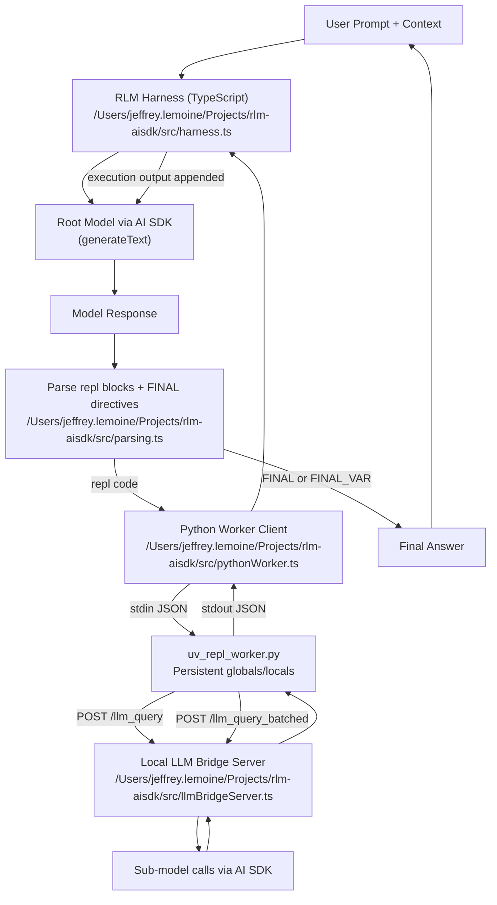

# Python Architecture in `rlm-aisdk`

This project uses a persistent Python worker process for REPL execution, coordinated by the TypeScript RLM harness.

## Key Files

- `/Users/jeffrey.lemoine/Projects/rlm-aisdk/src/harness.ts`
- `/Users/jeffrey.lemoine/Projects/rlm-aisdk/src/pythonWorker.ts`
- `/Users/jeffrey.lemoine/Projects/rlm-aisdk/python/uv_repl_worker.py`
- `/Users/jeffrey.lemoine/Projects/rlm-aisdk/src/llmBridgeServer.ts`
- `/Users/jeffrey.lemoine/Projects/rlm-aisdk/src/parsing.ts`
- `/Users/jeffrey.lemoine/Projects/rlm-aisdk/src/logging/traceTypes.ts`
- `/Users/jeffrey.lemoine/Projects/rlm-aisdk/src/logging/notebookRenderer.ts`
- `/Users/jeffrey.lemoine/Projects/rlm-aisdk/src/logging/notebookWriter.ts`

## How the Python Side Works

1. TypeScript launches the worker with `uv run python /Users/jeffrey.lemoine/Projects/rlm-aisdk/python/uv_repl_worker.py`.
2. TypeScript and Python communicate using line-delimited JSON on stdin/stdout (`init`, `exec`, `final_var`, `close`).
3. The Python worker keeps persistent `globals` and `locals` across `exec` calls.
4. Worker injects helper functions into the REPL namespace:
   - `llm_query(prompt, model=None)`
   - `llm_query_batched(prompts, model=None)`
   - `FINAL_VAR(name)`
   - `SHOW_VARS()`
5. `llm_query*` functions call a local HTTP bridge server in Node (`/llm_query`, `/llm_query_batched`).
6. The bridge calls AI SDK (`generateText`) for subcalls and returns responses to Python.
7. The root TypeScript harness parses model output for `repl` blocks, executes them in Python, appends execution feedback, and repeats.
8. Loop stops when model emits `FINAL(...)` or `FINAL_VAR(...)`.

## Notebook Logging Flow

Notebook logging is CLI opt-in (`--notebook-out`).

1. `harness.ts` captures run trace events while the root loop executes.
2. Trace includes root iterations, REPL exec code/output, and subcall summaries.
3. `notebookRenderer.ts` converts trace data into valid nbformat v4.5 JSON.
4. `notebookWriter.ts` writes an atomic `.ipynb` file (tmp write + rename).
5. The generated notebook can be opened directly in JupyterLab or VS Code.

## Mermaid Diagram

